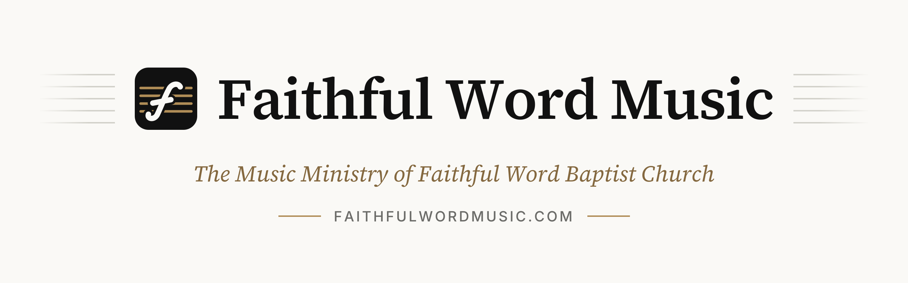

<p align="center">
  <picture>
    <source media="(prefers-color-scheme: dark)" srcset=".github/assets/banner-dark.png">
    
  </picture>
</p>

# Faithful Word Music

The website of **Faithful Word Music**, the music ministry of
[Faithful Word Baptist Church](https://www.faithfulwordbaptist.org/) in Phoenix, Arizona.

- **Live site:** https://faithfulwordmusic.com
- **Contact inbox:** contact@faithfulwordmusic.com
- **Editing words, links or the song list?** See **[CONTENT-GUIDE.md](./CONTENT-GUIDE.md)**, which needs no coding. This file is for developers.
- **The AI system** (in phases) has its own status and design document: **[AI.md](./AI.md)**.

---

## Contents

1. [At a glance](#at-a-glance)
2. [Quick start](#quick-start)
3. [Environment variables](#environment-variables)
4. [Project structure](#project-structure)
5. [How it works](#how-it-works)
   - [The song list](#the-song-list) · [The Service Planner](#the-service-planner) · [Next and Now](#next-and-now) · [Song history and the archive](#song-history-and-the-archive)
   - [The year in song](#the-year-in-song)
   - [The printable PDF](#the-printable-pdf) · [Sharing services](#sharing-services) · [The contact form](#the-contact-form)
   - [Sheet music](#sheet-music) · [Member accounts](#member-accounts) · [The signed-in experience](#the-signed-in-experience) · [Availability](#availability) · [AI](#ai)
6. [Design conventions](#design-conventions)
7. [Testing](#testing)
8. [Deploying to Vercel](#deploying-to-vercel)
9. [Setup guides](#setup-guides): [Retiring the Google Sheet](#retiring-the-google-sheet) · [Database (Neon)](#database-neon) · [Sheet music (service account)](#sheet-music-service-account) · [Resend](#resend) · [Accounts (Clerk)](#accounts-clerk)
10. [Gotchas](#gotchas)
11. [Accessibility and SEO](#accessibility-and-seo)

---

## At a glance

One Next.js app on Vercel. There's no separate backend or CMS. The song list is built in the signed-in **[Service Planner](#the-service-planner)** and stored in Neon Postgres; publishing a service puts it on the public song list, and nothing about it is baked into the build. The public site needs no login; invite-only [member accounts](#member-accounts) sit alongside it.

| Address | What it is |
|---|---|
| `/` | Home: what the ministry is, with links to the song list and contact page. Signed-in members are sent to `/dashboard` instead |
| `/song-list` | The congregational song list - every published service: next-service spotlight, month tabs, search, key filter, PDF and sharing, and (signed in, with sheet music types) each service's sheet music as one PDF |
| `/song-list/archive` | Every song ever sung, searchable, with counts and dates |
| `/song-list/archive/services` | Every past service as a complete song list, filterable by date, song, service, key and insert; `/song-list/archive/services/<date>-<am\|pm>` is one service |
| `/library` | The Library: every song with a page, A-Z (audio and other resources to follow). Old `/song-list/archive/<song>` links redirect to `/library/songs/<song>` |
| `/library/songs/<song>` | One song's history: times sung, keys used, upcoming services, plus its sheet music and details from the Sheet Music Index |
| `/library/songs/<song>/sheet-music/<file>` | One sheet-music file (PDF or `.mscz`) from private Drive, served only if the song's rights allow it |
| `/song-list/year/<year>` | A year of singing: most sung hymns, songs per month, keys, favourites (`/song-list/year` goes to the latest) |
| `/song-list/pdf/<month>` | A month as a one-page printable PDF |
| `/song-list/image/<month>?s=<ids>` | One to three services as a PNG picture, for sharing |
| `/contact` | Contact form, emailed to the ministry through Resend |
| `POST /api/contact` | The contact form's endpoint |
| `GET /api/cron/sync-archive` | Nightly job that saves past services to the archive database |
| `GET /api/cron/quarterly-report` | Emails the music director a report on the quarter just ended |
| `GET /api/cron/import-sheet-schedule` | **Temporary, run once:** copies the retired Google Sheet's upcoming services into the Service Planner (see [Retiring the Google Sheet](#retiring-the-google-sheet)) |
| `/login` | Member log in (Clerk). Linked only from the footer, never the main navigation |
| `/request-access` | Ask for an account. Creates a request for an administrator to review, never an account |
| `/accept-invite` | Where Clerk invitation emails land; the only place an account can be created |
| `/dashboard` | The signed-in home: what needs the member's attention and what is coming up for them |
| `/service-planner` | The Music Director's Service Planner: the work queue, `/service-planner/<date>-<am\|pm>` to plan one service, `/service-planner/inserts` for the weekly inserts, and `/service-planner/export` for spreadsheets and PDFs (`manage_service_plans`) |
| `/availability` | The music ministry's shared availability board: normal services, and dated exceptions for whole services. Musicians, song leaders and the music director only (`view_availability`) |
| `/profile`, `/profile/edit` | A member's own profile (who they are in the ministry) and its editor |
| `/account` | Account settings: Clerk's screen for sign-in email, password and devices. Old `/account/edit` and `/account/security` links redirect |
| `/admin/...` | Requests, invitations, people, roles, and the title and instrument lists. Each section needs its own permission |
| `/admin/ai` | The AI system's status, a connection test, and this month's AI usage and cost by feature (`use_ai`). See [AI](#ai) |
| `POST /api/account-requests` | The request form's endpoint |
| `GET /api/account/sheet-music` | The signed-in person's sheet music PDF for each published service, for the song list's cards |
| `/manifest.webmanifest`, `/app-icon/<variant>`, `/apple-icon` | What makes the site installable as the Faithful Word Music app, and its icons. See [Installing the app](#installing-the-app) |

**Stack:** Next.js 16 (App Router) · React 19 · TypeScript · Tailwind CSS v4 ·
Neon Postgres (service plans, song archive, accounts) · Google Drive and Sheets APIs (sheet music only) ·
Resend (email) · Vercel AI SDK and AI Gateway (AI) · Vercel BotID · `@react-pdf/renderer` (PDF) · ExcelJS (spreadsheet exports) ·
`next/og` (pictures and link previews) · Clerk (member sign-in) · Zod · Vitest.

> **Heads-up for contributors:** this is Next.js 16, which has breaking changes from older versions.
> Before writing Next-specific code, read the relevant guide in `node_modules/next/dist/docs/`
> (see [AGENTS.md](./AGENTS.md)).

---

## Quick start

```bash
npm install
cp .env.example .env.local     # then fill in real values (see below)
npm run dev                    # http://localhost:3000
```

The site runs without any keys. The song list shows a "not connected" message until `DATABASE_URL` is set, and the contact form returns a clear error until its key is added.

| Command | What it does |
|---|---|
| `npm run dev` | Development server with hot reload |
| `npm run build` | Production build |
| `npm run start` | Serve the production build locally |
| `npm test` | Unit tests (Vitest) |
| `npm run lint` | ESLint |
| `npx tsc --noEmit` | Type check |
| `npx next typegen` | Regenerate route types (needed after adding a route; see [Gotchas](#gotchas)) |

**Handy in development:** add `?now=2026-09-27T10:29:00-07:00` to `/song-list` to pretend it's that moment, which lets you check the Next/Now markers.

---

## Environment variables

All of these are **server-only secrets** except `NEXT_PUBLIC_CLERK_PUBLISHABLE_KEY`. Secrets never start with `NEXT_PUBLIC_`, because that prefix puts a value into the browser's JavaScript, where anyone can read it.

| Variable | Powers | Where it's read | Needed in |
|---|---|---|---|
| `GOOGLE_SHEETS_API_KEY` | **Retired.** Only the one-time import of the old song-list sheet; delete it with that route | `src/lib/google-sheets.ts` | Production, until the import has run |
| `GOOGLE_SERVICE_ACCOUNT_EMAIL` | Sheet music on song pages (optional) | `src/lib/google-auth.ts` | Development, Preview, Production |
| `GOOGLE_PRIVATE_KEY` | Sheet music on song pages (optional) | `src/lib/google-auth.ts` | Development, Preview, Production |
| `RESEND_API_KEY` | The contact form and archive alerts | `src/lib/resend.ts` | Development, Preview, Production |
| `DATABASE_URL` | The song list (Service Planner), the permanent archive and accounts | `src/lib/db.ts` | All, and added automatically by the Neon integration |
| `CRON_SECRET` | Protects the cron jobs (and the one-time import) | `src/lib/cron-auth.ts` | Production, and locally if you run them by hand |
| `NEXT_PUBLIC_CLERK_PUBLISHABLE_KEY` | Member accounts (optional). **Public**, and a **different value per environment** | Clerk SDK, `src/lib/auth/clerk-env.ts` | Local + Preview: `pk_test_…` · Production: `pk_live_…` |
| `CLERK_SECRET_KEY` | Member accounts (optional). **Different value per environment** | Clerk SDK, `src/lib/auth/clerk.ts` | Local + Preview: `sk_test_…` · Production: `sk_live_…` |
| `AI_GATEWAY_API_KEY` | AI features (optional). The Vercel AI Gateway key | The AI SDK; presence checked in `src/lib/ai/config.ts` | Development, Preview, Production |
| `AI_MODEL` | Which model AI features use (optional, not a secret). Default `openai/gpt-5.6-terra` | `src/lib/ai/config.ts` | Wherever it should differ from the default |
| `AI_MONTHLY_BUDGET_USD` | The monthly budget shown on Admin → AI (optional, not a secret). Default `10` | `src/lib/ai/config.ts` | Wherever it should differ from the default |

The two Clerk keys are the exception to "tick every environment": see [Accounts (Clerk)](#accounts-clerk).

- **`.env.local`** holds the real values for your machine. It's git-ignored.
- **`.env.example`** holds placeholders and documents what exists. It's committed.
- **Production values** are set in **Vercel → Settings → Environment Variables**, never in a committed file. Changing one requires a redeploy.
- To pull them down locally: `npx vercel env pull .env.local`.

The files that read secrets import `server-only`, so accidentally importing one into browser code fails the build instead of leaking a key. A missing key never crashes a page; the feature just shows a friendly error.

Anything **public** (the contact address, links, service times, the Service Planner's defaults) lives in `src/config/site.ts`, not in environment variables.

---

## Project structure

```
assets/fonts/                 TTF/WOFF fonts for the PDF, pictures and link previews
scripts/bootstrap-admin.mjs   Makes the first administrator, once per Clerk instance
src/
├── proxy.ts                          Signed-out visitors on the member pages → /login; signed-in visitors on / → /dashboard
├── app/
│   ├── page.tsx                      Home
│   ├── song-list/
│   │   ├── page.tsx                  Song list (server: the published schedule, then the interactive view)
│   │   ├── archive/                  The song archive, and archive/services/ - every past service plan
│   │   ├── pdf/[month]/route.tsx     Printable PDF of a month
│   │   └── image/[month]/route.ts    Shareable PNG of 1–3 services
│   ├── contact/page.tsx
│   ├── api/contact/route.ts          Contact form endpoint
│   ├── api/cron/sync-archive/        Nightly archive sync
│   ├── login/  request-access/  accept-invite/   Member log in, account requests, invitations (Clerk)
│   ├── dashboard/                    The signed-in home
│   ├── service-planner/              The Service Planner: queue, one service, inserts, exports, server actions
│   ├── conductor/                    Conductor, the AI assistant, as a full page
│   ├── api/conductor/                Conductor's questions, answered as a stream
│   ├── availability/                 The availability board and its server actions
│   ├── profile/                      A member's own profile and profile editor
│   ├── account/                      Account settings (Clerk: email, password, devices)
│   ├── admin/                        Requests, invitations, people, roles, titles & instruments, AI status and usage
│   ├── api/account-requests/         Account request endpoint
│   ├── layout.tsx                    Fonts, header, footer, base metadata
│   ├── globals.css                   Design tokens (@theme), motion, print
│   └── opengraph-image.tsx, sitemap.ts, robots.ts, icon.svg, not-found.tsx
├── components/
│   ├── song-list/                    Everything on /song-list (see below)
│   ├── account/  admin/              Account pages' forms, the account context and menu, and the admin editors
│   ├── dashboard/                    The Dashboard's sections
│   ├── service-planner/              The planner's queue, workspace, song picker and inserts
│   ├── conductor/                    Conductor: the shared conversation, its one view, and the floating panel
│   ├── availability/                 The availability calendar, dialogs and editors
│   ├── ui/                           Shared pieces: Button, Card, Reveal, BackToTop…
│   └── layout/  home/  contact/
├── config/site.ts                    Every public setting, in one place
├── content/                          All page wording (edit without touching components)
├── lib/                              Logic, kept free of UI (see below)
│   └── auth/                         Accounts: Clerk wrapper, session and permission checks, the account tables
└── types/song-list.ts                The song list's data shapes
```

**`src/lib`, the logic:**

| File | Job |
|---|---|
| `schedule.ts` | **The schedule read layer**: `getSchedule()`, the published song list every page reads (server-only) |
| `schedule-months.ts` | Shapes published services into song-list months, with placeholders for services still being planned (pure) |
| `service-planner/` | The Service Planner: `model` (places, inserts, locking, changes), `queue`, `intelligence` (planning facts and checks), `forms`, `format`, `export` (pure); `store.ts`, `load.ts`, `export-files.ts` (server-only) |
| `service-archive.ts` | The service-plan archive: past services as complete song lists, and their filters (pure) |
| `song-list.ts` | Song identity (`songKey`, `songSlug`), keys, search and filters (pure, no I/O). Still holds the old sheet parser until the import is done |
| `google-sheets.ts` | **Retired:** reads the old song-list sheet, for the one-time import only (server-only) |
| `service-time.ts` | Service times, Next/Now timeline, date formatting (Arizona time) |
| `song-history.ts`, `song-archive.ts`, `archive-store.ts`, `archive-view.ts`, `db.ts` | Song history and the archive database |
| `song-list-pdf.ts` | Fits a month onto one PDF page (row height, column split) |
| `share-services.ts` | The shared text format, and the three-service limit |
| `year-recap.ts` | The year in song: totals, most sung, months, keys, favourites |
| `service-picture.tsx` | Draws the shareable picture |
| `text-measure.ts` | Predicts where Inter text wraps (used by the PDF and the picture) |
| `og.tsx` | Link-preview cards, plus the fonts, logo and colours the picture reuses |
| `resend.ts`, `validation.ts` | Email sending and the shared form schema |
| `google-auth.ts` | The service account's access token (server-only) |
| `sheet-music-index.ts` | Reads the Sheet Music Index and streams files from Drive (server-only) |
| `sheet-music.ts` | Reads Drive folders and file names, joins them to the Songs tab, matches song-list songs, builds the browser-safe view (pure, no I/O) |
| `sheet-music-access.ts` | `canAccessFile()`: the one rule for who may open which file |
| `song-key.ts` | `canonicalKey()`: a song's own key (the Index's first, else the catalog's usual key), as opposed to the keys services played it in (pure) |
| `capo-policy.ts` | `capoRequired()`: whether a song needs capo sheet music - the site's thresholds, and one song's own setting (pure) |
| `auth/session.ts` | Who is asking and what they may do: the one gate for account pages and actions (server-only) |
| `auth/permissions.ts` | The permission list, the starting roles, and how roles and exceptions combine (pure) |
| `auth/store.ts`, `auth/schema.mjs` | The account tables in Neon, each row tagged with its Clerk instance (server-only) |
| `auth/clerk.ts`, `auth/clerk-env.ts` | Every Clerk Backend API call, and which Clerk instance may be used where |
| `auth/profile-visibility.ts` | Which profile fields each audience (self, staff, later other members) may see (pure) |
| `navigation.ts` | Which links and menus ("Tools") the header, mobile menu, footer and account menu show, for visitors and per permission (pure) |
| `dashboard/` | The Dashboard's logic: `focus` (what is relevant to this person), `attention` + `providers` ("Needs your attention"), `coming-up`, `repertoire`, `sheet-gaps`, `new-sheet-music` and `people` (pure); `load.ts` does the reads (server-only) |
| `ai/` | The AI system (see [AI.md](./AI.md)): `service.ts`, the one place a model is called (server-only); `store.ts`, the usage log (server-only); `config.ts`; `stream.ts`, the streamed answer's format; and `features`, `settings`, `errors`, `usage`, `format` (pure). `ai/conductor/` is the assistant: `tools`, `data`, `conductor` (server-only); `facts`, `instructions`, `context`, `limits`, `protocol`, `session`, `drawer`, `markdown` (pure) |
| `availability/` | Availability: `occurrences` (which services happen), `effective` (normal + exception = effective, the one rule), `board`, `summary`, `range`, `access` (who is on the board, whose records someone may change), `forms`, `format` (pure); `store.ts` and `load.ts` (server-only) |

**`src/components/song-list`, the main pieces:** `SongListView` (the interactive page),
`NextServiceSpotlight`, `ServiceCard`, `MonthTabs`, `SongSearch`/`KeySearch`, `PdfLink`,
`ShareButton`/`ShareBar`/`share-actions` (sharing), `SongListPdf` (the PDF layout), and
`active-month` (keeps the PDF button in step with the open tab).

Content, configuration, presentation and integrations are kept apart. Most pages are Server Components. Only the interactive parts run in the browser: the header's mobile menu, the song list, the archive and the contact form.

---

## How it works

### The song list

```
Service Planner  ──►  Neon (service_plans)  ──►  lib/schedule.ts  ──►  song list, home page, Dashboard, Library,
(Music Director)      published / draft          getSchedule()        song pages, search, PDF, pictures,
                                                 (published only)     Availability, history, quarterly report
```

- **One source of truth.** The Service Planner's database is the song list. The old Google Sheet is retired (see [Retiring the Google Sheet](#retiring-the-google-sheet)); spreadsheets are now only ever an *export*.
- **One read layer.** Every page that shows scheduled songs asks `getSchedule()` (`lib/schedule.ts`) or the history functions built on it (`lib/song-archive.ts`). They receive the shapes in `src/types/song-list.ts` and never see the planner's tables.
- **Only published services leave the read layer with songs.** Drafts never reach the public site, search, the Dashboard's coming-up list, PDFs or pictures.
- **Months** are calendar months: the current one, then each later month with a published service. A regular service not published yet shows as a placeholder ("Songs not posted yet"), so a month never looks shorter than it is; a cancelled one does not show. If its week's insert is already planned (and its draft hasn't been given an insert of its own), the placeholder shows that one song as "Planned insert". The same goes for the spotlight, the home page card and the Dashboard (`plannedInserts` in `src/lib/schedule-months.ts`). Each month can carry a short note from the planner, shown under the month and in its PDF.
- **Service addresses** are `<date>-<am|pm>` (`serviceAnchor()`), the same identity as the archive and Availability, so links to a service keep working.
- **Freshness:** publishing or editing a published service refreshes every page at once (`revalidatePath`); pages otherwise re-render at most every 10 seconds.
- **Environments:** the planner's rows are tagged with the Clerk environment, like the account tables. Production shows the live plans; Local and Preview show only their own test plans, so experimenting can never reach the real song list.
- **Failure:** `getSchedule()` never throws. Without a database the page shows a friendly error.
- **Sheet music on the cards:** for someone signed in with assigned sheet music types, every published card (and the spotlight) offers **Sheet music for this service** - the same one-PDF button as the Dashboard's Coming up, built by the same rule (`servicePacket()` in `lib/dashboard/coming-up.ts`). A service with none of their sheet music says so in quiet text instead. The page is static, so the cards ask `/api/account/sheet-music` once the page loads (`components/song-list/ServicePackets.tsx`); the answer is remembered for the tab, so the buttons are there at once on the next visit. Visitors and people without types see nothing extra.
- **Any type, for those who print for others:** someone with `manage_sheet_music` also gets three dots after the "i", listing every sheet music type the service has a PDF of (`serviceTypeOptions()`); each opens the same route with `?type=<id>`, which checks the permission itself. Their own button is unchanged, and the dots still appear when they have no sheet music of their own. The menu is the site's `Menu` (`components/ui/Menu.tsx`), shared with the share button.

### The Service Planner

Where the Music Director builds the song list: `/service-planner`, for anyone with **`manage_service_plans`** (the Music Director role by default). Musicians and song leaders never see it - they get the published song list, the Dashboard and the archive.

```
Expected regular service ─► Draft ─► Published ─► Occurred ─► Archived (frozen after 30 days)
Special service (created) ─┘
```

- **The work queue** answers "what do I plan next?": every service from today to the end of the month being planned, soonest first, each with its status (*Not started*, *Draft · 3 of 5 songs*). Published services fold away underneath, still one click from editing; cancelled ones too. The next month joins the list a week before it starts (`siteConfig.servicePlanner.planningLeadDays`); **Start planning <month>** brings it in sooner, one month per press (`?ahead=1`), and **Not yet** sends it away again with nothing lost (`lib/service-planner/planning-window.ts`).
- **Regular services are never created by hand.** Sunday AM, Sunday PM and Wednesday PM (`siteConfig.songList.regularServices`) exist for any date, generated by the same code Availability uses (`lib/availability/occurrences.ts`). Nothing is stored for one until it is first saved, published or cancelled.
- **Special services** (a conference, a holiday, an unusual weekday service) are created with **New special service**: a date, AM or PM, a name and a start time. They then work like any other service, and Availability lists them as soon as they exist. Every service is still identified by its date and AM/PM, so a date holds at most one morning and one evening service. A regular service can also be given a name or another time, or cancelled.
- **Planning a service** (`/service-planner/<date>-<am|pm>`): an ordered list of places, five by default but any number. Each place is a song (number, title, **this service's key**) or still empty. Add, replace, remove and reorder (up/down buttons, animated), change keys (the key last used is suggested), add or remove places. Changes stay on the page until **Save draft**, **Publish** or (on a published service) **Save changes**.
- **Choosing a song:** search by title or hymn number across everything ever sung, the planner's catalog and the Sheet Music Index. Each result shows when it was last sung, how often in the last year, other services it is planned for, recent keys, a Christmas-only flag, and whether it has sheet music. With nothing typed, it lists familiar songs not sung for the longest. "How often" counts an insert by the week (see [Counting inserts](#song-history-and-the-archive)).
- **New songs:** a song that isn't found can be added on the spot (title, and optionally number, collection and usual key). It goes into `catalog_songs` and gets a Library page straight away, before it is ever sung; sheet music and details can follow later.
- **Keys belong to the service.** Each service stores its own snapshot of every song - title, number and key as planned - so a Library change years later never rewrites what was sung.
- **A song has its own key too** (`canonicalKey()` in `lib/song-key.ts`): the first key on its row of the Sheet Music Index, or for a song the Index lacks, the catalog's usual key. That is the key filled in when a song is chosen (here and on Inserts) - never the key it was last sung in, unless it has no key of its own. A service or insert already saved in another key keeps it: the checks say "planned in F; its current key is G", and Inserts offers **Use it**. Nothing rewrites a saved key by itself.
- **Unsaved changes are guarded** (`useUnsavedGuard`, `components/ui/use-unsaved-guard.ts`): following a link, Back/Forward, reloading or closing the tab or app with changes not saved asks first - in the site's dialog for moves within the site, the browser's own prompt for the rest. Saving switches it off. Back/Forward are caught through the Navigation API, where the browser has it. A page that changes page in code on someone's behalf asks `leaveBlocked()` first (`components/ui/page-link.ts`).
- **Checks** beside the list follow every change (`lib/service-planner/intelligence.ts`). They inform and never block: a song twice; sung within two weeks; planned for a nearby service; a pairing repeated from the last three months; a Christmas song outside the Christmas season; songs missing from the Sheet Music Index; the expected musicians who have none of their assigned sheet music types for a song; musicians who lack the capo sheet music a song's key calls for; and a song planned in a key other than its own. Sheet music is said as briefly as it can be: musicians are named only when just some are without ("no sheet music for any of the expected musicians" otherwise), and when no song in the service has any, one line says so instead of one per song. **Who's there** lists who is away (with notes) or coming specially, from Availability's own rules (`effectiveAvailability()`). The facts and checks are structured data, so a future song-list assistant can read the same signals.
- **Publishing:** one service from its page, or several ticked in the queue and published together as **one publication** (`publications` row: who, when, how many). A future notification can then announce a week's services once rather than three times.
- **Published is not frozen.** A published service can be edited and stays published; **Return to draft** takes it off the song list. Every save records what changed, song by song (added, removed, moved, key changes), in `service_plan_events`, with who and when - ready for change history and notifications.
- **Locking:** a service more than 30 days past (`FRESH_DAYS`) is permanent history and read-only, enforced on the server - the same rule the archive keeps.
- **Two people at once:** each save carries the revision it started from; if someone else saved first, the save is refused with a **Reload** rather than overwriting their work.

**Inserts** (`/service-planner/inserts`): one insert - a Psalm or other song - per week (Sunday to Saturday). It goes into the **third place** of that week's Sunday AM, Sunday PM and Wednesday PM (`siteConfig.servicePlanner`).
- A service follows its week until its own insert is moved, replaced or removed; from then on the service's choice wins.
- **A song is shown as an insert only when it has no hymnal number** (`isInsert` in `lib/service-planner/model.ts`). A hymn from the hymnal chosen for the insert's place is a regular song: no Insert tag in the planner, the archive or the exports.
- Changing a week's insert updates its drafts and not-yet-started services straight away. Published services are never changed behind anyone's back: the week shows how many still have an older insert, with **Update them**.
- The page lists only what needs planning: no week that has already begun (the week of Sep 27 is gone by its Monday), the month being planned, and the next month on the same rule as the work queue (a week before it starts, or **Start planning <month>** / **Not yet**). Once a later month is up, a fully planned month folds to one line, and goes once the month after it is planned too (`lib/service-planner/inserts.ts`).
- The long-range insert plan is the Music Director's; everyone else sees an insert only as a song in a published service.

**Exports** (the queue's **Export** panel, or `/service-planner/export?format=…&from=…&to=…` or `&services=…`): one-way copies, never read back.
- **Raw data** (`.xlsx` or `.csv`): one row per song - date, weekday, service, AM/PM, start time, position, hymn number, song, key, insert, special, status - with a frozen, filterable header.
- **Formatted song list** as **PDF** (the song list's own PDF, one page per month) or **`.xlsx`** (one sheet per month in the same two-column layout, still an ordinary editable spreadsheet).
- Any range up to three years, chosen services, or history: dates before the planner come from the archive. Drafts only when asked.

**Who can do what:**

| Permission | Default roles | Gets |
|---|---|---|
| `manage_service_plans` | Music Director | The Service Planner: drafts, inserts, special services, publishing, editing published services, exports, the planner's Dashboard items, and the audit details on archived services |
| `view_service_plans` | Song Leader, Musician, Music Director | Published service plans and what to prepare for them (the Dashboard's Coming up, sheet music) |

Every page and every server action checks the permission on the server (`src/app/service-planner/actions.ts`, each wrapped in `withPermission("manage_service_plans")`); hiding the link is never the protection.

**The tables** (created on first use, `lib/service-planner/store.ts`; each row tagged `clerk_env`): `service_plans` (one row per touched service: places as `jsonb`, status, insert mode, revision, created/updated/published by and at), `publications`, `service_plan_events`, `insert_weeks`, `catalog_songs`.

### Next and Now

Every service is an exact moment in Arizona time (UTC−7 all year), so the markers are right for visitors anywhere. The browser keeps its own clock (`components/song-list/use-now.ts`):
- A service is **Next** right up to its start time.
- It's then **Now** for 90 minutes, while Next moves on to the following service.

No reload is needed. The page opens on whichever month tab holds the next service.

### Song history and the archive

Every past service is kept in the permanent archive (`services` and `service_songs` in Neon). A nightly Vercel Cron job (`vercel.json` → `/api/cron/sync-archive`, 3 AM Arizona time) copies each published service that has taken place into it. Only Production's plans are archived, since the archive is shared by every environment. The archive's oldest rows came from the retired Google Sheet and are kept exactly as they were.

- **Fresh for 30 days:** a recent service can still be corrected in the Service Planner, and the planner's version wins.
- **Frozen after that:** the service becomes permanent history; the planner no longer lets it be changed.
- **Always up to date:** pages combine the archive with the published plans, so the history is current even before the nightly run.
- **Two views of the same history:**
  - **By song** - `/song-list/archive`, the year in song, and every song's page at `/library/songs/<song>` (address from `songSlug()`): how often, when, in which keys. The hints under upcoming songs ("Last sung 3 weeks ago") come from the same history.
  - **By service** - `/song-list/archive/services`: every past service as a complete song list, newest first, filtered by date range, song or hymn number, service (Sunday morning, Sunday evening, Wednesday, special), key, and inserts only. Each service has its own page with every song, number, key and insert, earlier/later links, and - for those who manage service plans - who planned, published and changed it. The planner's **Archive** tab opens here; the archive's **Songs | Service plans** switch moves between the two views.
- **The Library** also lists songs added in the planner's catalog that have not been sung yet.
  - "First time ever / this year" hints are switched off (`showFirstTimeHints: false`) until the records, which start in October 2025, go back far enough to be trustworthy.
- **"Often sung with":** a song's page lists up to three songs it is habitually paired with (`buildCompanions()` in `lib/song-history.ts`). A pair only counts when it was sung together at least 3 times, and in at least a third of the services where either song was sung, so a hymn that's simply sung a lot doesn't look paired with everything. Most songs have no such partner and show no section at all. Tune the rule with `siteConfig.songList.pairings`.
- **Quarterly report:** on January 1, April 1, July 1 and October 1 at 7 AM Arizona time, a Vercel Cron job (`/api/cron/quarterly-report`) emails a report on the quarter just ended to `siteConfig.mail.to` only. It is kept short. First come four totals compared with the quarter before. Next is **Before you plan**: close repeats already scheduled, songs due to come back, forgotten favourites, and songs sung this time last year but not since. Last is a brief **Looking back**: a chart of variety by quarter, most sung, new songs, habitual pairs, and a bar chart of keys. Charts are HTML tables, since mail apps strip scripts and SVG, and every bar carries its value. Lists are capped at five songs (eight for the season ahead), sections with nothing to say are left out, and it uses the site's fonts and colours, including its dark theme where the mail app allows. The figures are in `lib/quarterly-report.ts`, the email layout in `lib/quarterly-report-email.ts`, and its thresholds are constants at the top of the first.
- **Counting inserts:** the week's insert is sung at all three services on purpose, so anything that measures *frequency* counts a song without a hymnal number once per church week it was sung in, Sunday to Saturday (`usageCount()` in `lib/song-history.ts`): the year's most sung, favourites and "sung just once", a song's rank, the quarterly report's most sung, variety share and forgotten favourites, the Dashboard's most sung, and the planner's "N× in 12 months". Such a figure reads "4 weeks", not "4 times". Literal counts are untouched: the archive's times sung, a song page's totals, timeline and history, songs-sung totals, keys and exports - and every performance stays on record.
  - Christmas songs follow the church rule: sung only from the first service after Thanksgiving to Christmas Day (`lib/church-calendar.ts`). A Christmas song is detected from the records as one only ever sung in that season. Christmas songs are never called due, forgotten or overused, get their own list when the coming quarter holds Christmas, and are flagged if scheduled before the season.
  - It is sent at most once per quarter (recorded in a `report_log` table), and only from production.
  - To see it without sending, run `curl -H "Authorization: Bearer <CRON_SECRET>" "http://localhost:3000/api/cron/quarterly-report?preview=1&at=2026-10-01" > report.html`. `at` shows it as it would be sent that day. `?force=1` (with `&at=` if wanted) sends a test copy now, subject marked "[Test]". It is never recorded as sent, so the scheduled email still goes out.
- **Links:** every song title, on the schedule, in the archive and on the year pages, links to its song page, with a faint dotted gold underline so it reads as a link (`SongLink` / `songLinkClasses`). **A link to a song's page opens in a new tab** (`songLinkProps`, on `SongLink` and on every link that builds its own markup: the Library index, search results, the year pages, the Dashboard), so the list being read stays as it was. The installed app on a phone or tablet has no tabs, so there the same links open in place (`InstalledApp`). Links that select, filter or expand something are not song-page links and are unchanged. The song page also shows the song's sheet music (see [Sheet music](#sheet-music)).
- **Alerts:** if a nightly run fails, an email goes to `siteConfig.songList.alertEmail`. That happens in production only.

### The year in song

`/song-list/year/<year>` sums up one year from the same history as the archive (`getYearRecapData()` in `lib/song-archive.ts` → `buildYearRecap()` in `lib/year-recap.ts`, which is pure and tested). `/song-list/year` redirects to the latest year with songs.

- **What it shows:** the year in one sentence, the ten most sung songs, songs per month, keys by use, morning and evening favourites, the song that came back after the longest gap (measured across years), the year's first song, the busiest month(s), and the songs sung only once - oldest first, on the page and in its "and N more" list alike.
- **Partial years:** the current year reads "So far in 2026". 2025 reads "Since our records began in October 2025". Months before the records or still to come show a dashed stub, not a zero.
- **Charts** are plain HTML and CSS in the site's gold, with hover tooltips and a screen-reader table for the monthly figures. There's no chart library.
- Linked from the archive page and the bottom of the song list. The current year is in the sitemap.

### The printable PDF

The **PDF** button opens the open month as a PDF in a new tab (`/song-list/pdf/september`). The browser's own PDF viewer then handles printing and downloading, so it comes out the same on every device, phones included. That's why it replaced printing the web page directly.

- **Layout** (`components/song-list/SongListPdf.tsx`) is the printed song list as it has always looked: the whole month, two columns reading down, on **one Letter page**. A special service is headed by its own name. The Service Planner's PDF export uses the same component for any range of months.
- **Fitting** (`lib/song-list-pdf.ts`): it measures real title widths to predict wrapping, picks the tallest rows that still fit, and balances the columns.
  - A service is never split. An unusually long month moves whole services onto a second page rather than cutting any off.
- **Nothing live** is printed: no Next/Now, no hints, no search filter.
- Built on request from the published schedule, so it's as fresh as the page.

### Sharing services

Each service card has a **share** button. **Select** (just above the cards) lets you tick **up to three** services and share them together from a bar at the bottom of the screen.
- At three, the other cards grey out, and tapping one explains the limit.
- The limit is `MAX_SHARED_SERVICES` in `lib/share-services.ts`, used by both the page and the picture.

**Two formats:**

| As text (`lib/share-services.ts`) | As a picture (`lib/service-picture.tsx`) |
|---|---|
| Readable right in the message, with nothing to open. | The site's look: gold rule, serif date, hymn numbers and key badges. |
| `Sunday Morning · Sept 27 · 10:30 AM`, then one line per song (`#114  The Great Physician – Eb`, or `–` for songs without a number), then the link to the song list. | Always one column, phone-shaped. One service is roomy (1080 × ~1190). Two or three use a compact version, so three still fit one phone screen (≤ 1080 × 2340). Sent on its own: a phone decides the order of what one share holds, and an iPhone puts a link ahead of the picture. The picture's footer carries the song list's address. |

**What each device offers:**
- **Phone:** *Send as picture* or *Send as text*, each opening the phone's share sheet.
- **Computer:** *Copy picture*, *Save picture*, *Copy text*, *Email*, and *More options…* (the system share panel). The picture comes first because it's what people share most.

Phones only allow a share right after a tap, so the picture is fetched as soon as the menu opens and is ready by the time it's chosen.

> The share sheet and clipboard only work on **HTTPS** (or `localhost`). Opening the dev server from a phone at `http://192.168.x.x:3000` shows the Copy/Email fallback instead, which is expected.

### The contact form

```
visitor → /contact → POST /api/contact → BotID → honeypot → Zod validation → Resend → contact@faithfulwordmusic.com
```

- **Validation:** the same Zod schema checks the form in the browser and again on the server.
- **Addressing:** email is sent **from** the site's verified address, **to** the ministry inbox, with **Reply-To** set to the visitor, so pressing Reply answers them directly.
- **Status codes:** `200` sent · `400` invalid · `403` blocked by BotID · `502` Resend rejected it · `503` not configured. Responses never include stack traces, and message contents are never logged.

**Spam protection:** three layers, none of which asks the visitor to do anything.
1. **Vercel BotID:** an invisible browser challenge, checked on the server with `checkBotId()`.
   - The protected routes are listed in `src/instrumentation-client.ts` and must match the API route.
   - `withBotId()` in `next.config.ts` serves the challenge from this domain, so ad-blockers can't drop it.
   - A blocked visitor is shown the email address, so a false positive still has a way through.
   - Under `next dev` it always passes. To test the rejection path, temporarily pass `developmentOptions: { bypass: "BAD-BOT" }`.
2. **A honeypot field:** if a bot fills it in, the form returns `200` and sends nothing, so the bot can't tell it was caught.
3. **A firewall rate limit,** set in the Vercel dashboard rather than in code (an in-memory limit wouldn't hold across serverless instances):
   - **Firewall → Configure → New Rule:** Request Path equals `/api/contact` **and** Method equals `POST` → **Rate Limit**, Fixed Window, `600s`, `10` requests, keyed on IP.
   - Leave the exceeded-action on **Log** for the first week, then switch it to **Deny**.

### Sheet music

Song pages show what the private **Sheet Music Index** (a Google Sheet, ID in `siteConfig.sheetMusic`) knows about a song, and its sheet music when it may be shared. The files themselves stay in private Google Drive.

```
Sheet Music Index (private) ─┐                          ┌─> song page: details + sheet-music buttons
                             ├─ service account ─> server ┤
Google Drive (private) ──────┘   (read-only)             └─> /library/songs/<song>/sheet-music/<file>
                                                             after canAccessFile() says yes
```

- **The Drive folders are the file index.** The server lists everything shared with the service account, in about 5 requests at most every 10 seconds, and only when someone visits (never per page view), and reads each file's folder and name. Adding sheet music means dropping a file into a folder one of the sheet music types uses. Nobody types file IDs anywhere.
- **Which type a file is** comes only from the types' **source folders**, set under Admin → Configuration (see "Sheet music types" below). No folder layout is assumed. The defaults point at today's layout:

  ```
  Standard            each hymnal's (and Psalms', Other Songs') Standard folder,   and 03 - Ensemble & Classical
  Standard (Chords)   each Chords › Standard folder in 01 - Congregational
  Capo (Chords)       each Chords › Capo folder in 01 - Congregational
  ```

  Anything no source holds (`90 - Reference/…`, say) never appears. A file's **collection** is the nearest folder above it named like a Collection on the Songs tab, at any depth.

  Filenames work like this:
  - **Numbered:** `121 - Like a River Glorious.pdf`. `121 Title` and `014 - Title` also work.
  - **Unnumbered:** `Psalm 54.mscz`.
  - **Versions:** a trailing ` (2)` marks version 2; no number means version 1.
  - **Notes:** other bracketed notes such as `(Stedfast Baptist Church)` are ignored.
  - **Drafts:** anything containing `IN PROGRESS` is skipped.
  - **Duplicates:** when the same file exists twice, the most recently changed copy wins.
  - **Where it lives:** `readSheetMusic()` and `classify()` in `lib/sheet-music.ts`, and `listDrive()` in `lib/sheet-music-index.ts`.
- **The Index (Sheet Music Index sheet):**
  - **Songs** has one row per song, keyed by **Song ID** (`SSSH1989-233`). It holds the details and the rights. A file joins its song by Collection (the folder name) + Hymn Number, or, without a number, by a title only one song in that collection has. Bracketed notes and punctuation are ignored when matching titles.
  - A file whose song has no Songs row is left out, since there's no rights decision for it.
  - **Versions** (older name: **Editions**) is optional. A row only adds a key or capo fret to one version of one type; its **Variant** column takes the type's name (e.g. `Capo (Chords)`; the older `Standard`, `Chords` and `Capo` still work). It never has to exist.
  - Columns are found by header name, and blank or placeholder cells (`?`) are ignored.
  - The Files tab is no longer read. **Notes**, **Migration** and **References** never are.
- **Matching a page to the Index:** a numbered song is looked up by its number in `siteConfig.sheetMusic.hymnalCollection` (Soul-Stirring Songs and Hymns 1989). An unnumbered song (a Psalm or an insert) is matched by title, but only when exactly one Index song has that title; an ambiguous title shows nothing rather than the wrong music. Pages still only exist for songs that have been sung or scheduled. Once a song gets a page, its Index entry appears automatically.
- **Public details vs. protected files:** every matched song shows its details (composer, words, key, collection…), leaving out blank fields. The files are a separate question, answered by `canAccessFile()` in `lib/sheet-music-access.ts`.
- **Rights:** a song's files are **public only when `Copyrighted?` is exactly `No`**. `Yes`, `Needs Review`, a blank or any other value keeps them from the public. **Signed-in members can open every file**, copyrighted or not, if their roles include **View member sheet music** (the Member role has it by default, so that means every account; change it under Admin → Roles).
- **Enforced on the server:** the file route runs `canAccessFile()` itself before touching Drive. A restricted file returns `403` even if someone types its address.
- **PDF first, MuseScore second:** a PDF gets the main **View PDF** button and, on larger screens, an inline preview. It is served `inline`. A MuseScore file gets a secondary **Download MuseScore** button and is sent as the untouched original `.mscz`.
  - The format comes from the file's `.pdf` / `.mscz` extension. Drive's MIME type is ignored, because Drive often reports `.mscz` files (zip containers) as zip archives.
- **What reaches the browser:** file addresses use a slug (`standard-1.pdf`, `capo-2-guitar.mscz`), never a Drive File ID. The Drive IDs, notes and paths stay on the server.
- **Freshness:** the Drive listing and the Index are cached together for `siteConfig.sheetMusic.revalidateSeconds` (10 seconds), so a new file shows up within about 10-20 seconds. Served files are cached at the CDN for the same time, so making a song private again takes effect about as quickly.
- **Without credentials:** the song pages work as before with no sheet-music section, and the file route returns `503 {"reason":"not-configured"}`.
- **Members-only files:** song pages stay cached and identical for everyone. Copyrighted files are listed with "Members only · Log in"; in the browser, `MemberSheetMusic` asks `/api/account/me` whether the visitor may see them and unlocks the buttons and the preview. The file route decides for itself: a public file needs no session; any other needs a signed-in member with the permission (`401` signed out, `403` without access), and is sent `Cache-Control: private, no-store` so no shared cache ever keeps it.

### Member accounts

Invite-only accounts for the musicians and song leaders. The public site doesn't change: nothing public needs a login, and **Log In** isn't in the main navigation. It lives in the footer ("Have an account? **Log in!**").

**Who owns what:**
- **Clerk** owns *who someone is*: sign-in, sessions, passwords, email verification, invitations, bans, names, email addresses and profile photos.
- **This site** owns *what they may do*, plus their music profile. That's roles, permissions, account requests, titles, instruments and profile answers, all in the existing Neon database. Rows are keyed by Clerk user ID. Clerk data is read from Clerk, never copied.

```
request:  /request-access → POST /api/account-requests → BotID → honeypot → Zod → row (pending) → Resend email to the ministry
approve:  /admin/requests/<id> → claim row (pending→invited) → Clerk invitation email → /accept-invite?__clerk_ticket=… → account
          (if Clerk refuses, the claim is released: the request is pending again and nothing was sent)
invite:   /admin/invitations → Clerk invitation directly (no request needed)
```

**Roles at invitation time:** when inviting someone, or approving their request, you can tick the roles they should have (Musician, Song Leader…). They're stored with the invitation (`invitation_roles`) and given automatically the first time the new account is used, matched on the verified email the invitation went to. Choosing roles follows the same rules as assigning them on a person's page: it needs Manage roles, and only administrators can hand out Administrator. Revoking the invitation discards them.

**Request lifecycle:**
- **pending:** waiting for review. It can stay pending indefinitely.
- **invited:** approved, and the invitation has been sent.
- **active:** the invitation was accepted.
- **rejected:** declined by an administrator.
- **revoked / expired:** the invitation was withdrawn, or ran out before it was used.

"Invited" is brought up to date from Clerk whenever the requests are viewed, so no webhook is needed.

**Privacy of the request form:** the reply is identical whether the address is new, already has an account, already has an invitation, or already has a pending request. Nobody can use the form to find out who has an account. Duplicates are dropped silently (a unique index backs this up), and no email goes out for them. The notification email only links to the review page. It can't approve, decline or change anything.

**Roles and permissions** (`src/lib/auth/permissions.ts`):
- **Permissions are defined in code**, because each one guards a piece of code. For example, `manage_users` guards requests, invitations, disabling and deleting.
- **Roles are data.** The site starts with Administrator, Music Director, Song Leader, Musician and Member. In `/admin/roles` you can change what each role allows or create new roles. Administrator is locked to every permission. Member is held by everyone signed in.
- **People can hold several roles**, and their permissions add up. The actual music director should hold *both* Administrator (accounts and site) and Music Director (music).
- **Per-person exceptions** grant or deny one permission on top of someone's roles, from their page under **People**.
- **Effective permissions** = every role's permissions + grants − denies. An administrator can never be denied `manage_users` or `manage_roles`, so nobody can be locked out by mistake.
- **Escalation guards:**
  - Nobody can change their own exceptions. Only administrators can change their own roles (they already hold every permission), and nobody can remove their own Administrator role.
  - Only administrators can give, remove or disable the Administrator role.
  - Nobody can grant a permission they don't hold.
  - The last administrator can't be removed.

**Profiles:**
- **Owners:** Clerk holds the first name, last name and photo. The site holds the middle name, preferred name, bio, phone, voice part, usual services and instruments (each with a skill level and a primary).
- **Questions:** everyone answers "Can you read sheet music?" and gives a music-theory level. **Musicians** also answer **How do you play?** (a five-stop By ear ↔ Sheet music scale).
- **Titles** (Pianist, Organist…) are assigned by administrators. The title and instrument lists are edited under **Admin → Configuration**. An item still in use is archived, not deleted.
- **Visibility:** a profile is visible to its owner and to anyone with `view_profiles`, which by default is only Administrator. (Normal services are also seen by the music team on the [availability board](#availability).)
- **Usual services** are shown on the profile but edited on `/availability`. The profile form never writes them, so saving it can't wipe them.

**Security model:**
- **Every protected page and every server action checks, on the server:**
  - the Clerk session is verified;
  - the user ID is resolved to this site's roles for this Clerk instance;
  - the permission is checked;
  - the input is validated;
  - and only then does the action run.
  This all goes through `src/lib/auth/session.ts`.
- **Things that are never trusted:** hidden buttons, the header menu, the proxy and the admin layout. The header's "Admin" link is only a convenience.
- **The proxy** (`src/proxy.ts`) only sends signed-out visitors on `/dashboard`, `/availability`, `/profile`, `/account` and `/admin` to `/login?redirect_url=…`, so they come back afterwards, and sends signed-in visitors on `/` to `/dashboard`. It doesn't run on any other public page, so they stay static and cached. It matches those sections with its own prefix list, not Clerk's deprecated `createRouteMatcher`: path matching here only decides a redirect, and each page and action protects its own data.

**One database, two Clerk instances:**
- Local, Preview and Production share one Neon database, but Clerk Development and Production have separate users.
- Every account row therefore carries `clerk_env` (`development`/`production`), derived from the key prefix, and every query filters on it.
- Test users and test requests never appear in the production admin.

**When accounts are off:** if the Clerk keys are missing, or they're wrong for the environment (test keys on Production, live keys anywhere else, a mismatched pair), accounts switch off. The public site carries on unchanged, the account pages fail closed with "Accounts are temporarily unavailable", and the reason is logged once as `[auth] Accounts are disabled: …`. The log never includes key values.

The tables are created on first use, like the song archive's: see `src/lib/auth/schema.mjs`.

### The signed-in experience

The site is two experiences on one codebase:
- **The public site** is the ministry's front door: home page, song list, Library, contact. Static and cached, the same for everyone.
- **The signed-in application** is a working space for the music ministry. Its home is the **Dashboard**.

**Four places, four jobs:**

| Page | Answers | Owner |
|---|---|---|
| `/dashboard` | What do I need to know and do? What is coming up? | Built from current data |
| `/profile` | Who am I in the ministry? (names, photo, bio, titles, instruments, music answers) | The site, plus name and photo from Clerk |
| `/account` | How do I sign in? (email, password, devices). Later: account-wide settings such as notifications and profile privacy | Clerk |
| `/admin` | Running the ministry's accounts | The site |

Editing happens on the page being edited (the **Edit profile** button on `/profile`), never from a menu.

**Signed-in people never see the public home page.** The proxy redirects `/` to `/dashboard` when there is a session, and the logo links to the Dashboard. The home page itself never reads the session, so it stays prerendered (ISR) for visitors.

**Logging in:**
- **Returning members** logging in with no page to return to (e.g. the footer's **Log in!**) land on `/dashboard` (`signInFallbackRedirectUrl` in `layout.tsx`).
- **New members**, straight after creating their account from an invitation, land on `/profile/edit?welcome=1` (`signUpFallbackRedirectUrl`): the profile form introduced as "Set up your profile", where saving or skipping carries on to the Dashboard.
- Sent to log in from a members' page, they arrive with `?redirect_url=…` and go back to that page, which always wins over the fallback.
- Logging out goes to the public home page.

**Navigation** (`src/lib/navigation.ts`, one place for every menu):
- Visitors: Home, Song List, Library, Contact.
- Signed in, in this order: **Dashboard** (in Home's place), **Service Planner** (`manage_service_plans`), **Song List**, **Library**, **Availability** (`view_availability`, never Member-only accounts), **Contact**. Each signed-in destination shows only to someone holding its permission.
- The avatar menu holds Dashboard, Profile, Account settings, Admin (only with an admin permission) and Log out. On phones the avatar stays in the header bar; the full-screen menu shows the same main links as the desktop bar. The bar gives way to the menu below 1024px (`lg`), so the links never wrap.
- A new destination is one entry in `APP_NAV` (or `ACCOUNT_MENU`) with the `permission` that opens it. Nothing unfinished is listed.

**Why the header finds out in the browser:** public pages are static, so they can't know who is looking. `AccountProvider` (`components/account/AccountContext.tsx`) reads the Clerk session in the browser and asks `/api/account/me` once for the person's own permissions. The header, footer, search and members' sheet music all share that one answer. A signed-in person briefly sees the visitor's links on a static page until Clerk loads; that is the price of keeping the public site static. **Showing a link is never the protection**: every page, file and action checks permissions again on the server.

**How the Dashboard decides what to show:**

| Source | Decides | Example |
|---|---|---|
| **Permissions** | What may be shown or linked (security) | Members-only sheet music is linked only with `view_sheet_music`; account requests appear only with `manage_users` |
| **Roles** | Broad responsibilities | Musician and Song Leader mean the service music matters to them |
| **Titles, instruments** | What is most relevant | Each person's sheet music comes from their assigned sheet music types (e.g. Capo (Chords), then Standard (Chords)). A title never grants anything |
| **Current data** | What appears at all | No "0 requests", no empty cards, no placeholders for future features |

- These come together in one `DashboardFocus` (`lib/dashboard/focus.ts`). Capabilities are read from permissions, never role names, so a custom role with the right permission gets the same Dashboard.
- Someone with several responsibilities (say Administrator, Music Director and Pianist) gets **one** page: each section draws on the parts of the focus it needs, and attention items are de-duplicated by id.
- **Sections**, in this order for everyone (absent sections are skipped): things to do, this week, availability, preparing, what changed, the wider picture. Each is shown only when it has something real to say, except Availability, which is always there for the people it applies to.

  | Section | Who sees it | What it shows |
  |---|---|---|
  | **Needs your attention** | Everyone (items by permission) | The next service to plan ("Sunday Evening · Sun, Oct 11 - Draft · 3 of 5 songs", urgent within three days) and how many services need planning in the next two weeks, linking into the Service Planner (`manage_service_plans`); an unfinished profile; account requests waiting and invitations unanswered after a week or recently expired (`manage_users`); upcoming songs with sheet-music gaps and musicians with no sheet music type (`manage_sheet_music`); musicians who list no instrument (`view_profiles`); no normal services set (`view_availability`, low priority) |
  | **Coming up** | Everyone | The next services (up to three within a week). Someone with assigned sheet music types gets each service's sheet music as one PDF to print, using for each song the first of their types it has. With more than one type, each song names the type used and links their other types it has; a song with none of their types says so |
  | **Availability** | `view_availability` | Always present, kept short: their normal services, the next service and their state for it, their upcoming exceptions, other people's changes in the next two weeks, and **View availability** |
  | **Songs to brush up on** | People who play or lead | Songs in the next two weeks not sung for six months, or not in the records at all |
  | **Sheet music to finish** | `manage_sheet_music` | Songs in the next three services (never further ahead, however much of the month is planned) with no Index entry, no files, no sheet music of the first type (Standard by default), no capo sheet music where the song's key calls for it, sheet music with MuseScore but no PDF, or rights still to review |
  | **New sheet music** | Everyone, among files they may open | Songs whose files changed in Drive in the last two weeks, upcoming first |
  | **People** | The admin People permissions | Musicians (with their sheet music type, for `manage_sheet_music`), song leaders and people with no role beyond Member, each linking to their admin page |
  | **Quarter at a glance** | `view_analytics` | Services, different songs and the most sung so far this quarter (or the quarter just ended, before the new one's first service) |

- **Sheet music types are assigned, never guessed.** Two people on the same instrument can need different sheet music, so each person's types are chosen on their page under **Admin → People** by anyone with `manage_sheet_music`, in order of preference. A guitarist might have **Capo (Chords)**, then **Standard (Chords)** for songs that need no capo. Each song uses the first of their types that has a PDF they may open (a MuseScore-only file doesn't count); one with none of them shows as unavailable, never as another type. The order only chooses what is shown and never restricts access. No types means no sheet music. Types live in `user_sheet_music_types`; the older one-type `user_sheet_music` was copied in once, and still mirrors each person's first choice for older deployments sharing the database.
- **Capo sheet music is asked for by key, in one place** (`capoRequired()` in `lib/capo-policy.ts`).
  - A song needs it when its own key (`canonicalKey()`, never one service's key) has enough flats or sharps: by default **any flat**, or **three sharps or more**. Both thresholds, and which type is the capo sheet music, are set under **Admin → Configuration → Capo sheet music** (`manage_sheet_music`); either rule can be switched **Off**. A key that can't be read asks for nothing.
  - One song can be set apart on its page in the Library - **Use the site's capo policy**, **Always** or **Never** - by anyone with `manage_sheet_music` (`SongCapoSetting`, through `/api/account/song-capo`, since song pages are static). The song's setting wins.
  - Two checks use it, and nothing else decides it: the planner names the musicians whose list holds the capo type when a song needs capo sheet music and has none (another of their types is no substitute in that key), and the Dashboard's **Sheet music to finish** lists the song. A song that needs none is never held to it.
  - Stored in `site_settings` (`capo_policy`) and `song_settings` (one row per song set apart, by `songKey()`), tagged `clerk_env` and created on first use like the other account tables. Until a policy is saved, the capo type is the starting **Capo (Chords)** type, or the first type with "capo" in its name.
- **Types come from source folders, not folder layout.**
  - The types (defaults: Standard, Standard (Chords), Capo (Chords)) are named, ordered and given their **source folders** under **Admin → Configuration**.
  - Every type works the same way: it's a list of folders, each picked by browsing the Drive "Sheet Music" folder (**+ Add folder**) and removed with ×. A type takes every PDF and MuseScore file in its folders and the folders inside them, so you never pick a PDF or MuseScore folder. How the folders are laid out is never assumed.
  - If one type's folder sits inside another type's folder, the files go to the type whose folder is closest to them, then to the type higher in the list.
  - Files in no type's folders don't appear on the site. When you add a new hymnal or instrument folder in Drive, add it to the right type.
  - The three starting types are seeded as "every `Chords › Capo` folder inside `01 - Congregational`" and so on. The first visit to Configuration turns these into the actual folders (`expandSheetMusicSources`), after which they're plain folder lists like any other type.
  - A file's song comes from its name (number, title) and the nearest collection-named folder above it.
  - Song pages, the Dashboard and download names all use the type names. The Versions tab's "Variant" column takes a type name (older names like "Capo" still work).
  - Stored in `sheet_music_types`, `sheet_music_type_sources` and `user_sheet_music`. The logic is `classify` in `src/lib/sheet-music.ts` and `src/lib/sheet-music-type.ts`.

- The logic is in `lib/dashboard/` (pure, tested); the reads are in `lib/dashboard/load.ts`, each failing soft so one source being down never takes the page with it.

**Adding a feature to the signed-in application** (Notifications…; Availability and the Service Planner followed these steps):
1. Its route, protected by `requireViewer()` and its own permission (added to `permissions.ts` when something checks it), and added to the proxy matcher, `MEMBER_SECTIONS` and `robots.ts`.
2. A nav entry in `lib/navigation.ts` gated on that permission, an `error.tsx`, an `opengraph-image.tsx` (`renderOgCard`), and its pages named in `backLabel()` (`lib/page-origin.ts`).
3. If it can need action, an attention provider in `lib/dashboard/providers.ts` returning `AttentionItem`s (nothing when there is nothing to do).
4. If it belongs on the Dashboard, its data loaded in `app/dashboard/page.tsx` (failing soft) and a section shown only when the focus and data call for it.

**Profiles are built to be shown to other members later.**
- `lib/auth/profile-visibility.ts` classifies every profile field by audience:
  - `self`, the owner;
  - `staff`, holders of `view_profiles`;
  - `members`, other signed-in members (not reachable yet).
- Pages filter with `visibleProfile()` on the server, so a hidden field never reaches the browser, and `ProfileView` renders what it is given.
- **Member profiles, when built:**
  - Live at `/people` and `/people/<id>` (`/profile` always means "mine").
  - Get their own permission, returned as the `members` audience from `audienceFor()`.
  - Any "show my profile to members" choice belongs on `/account`.

#### Installing the app

Signed-in members can install the site as the **Faithful Word Music** app. It opens in its own window, with no browser bar, on the Dashboard (`start_url`).

**The app's login screen** is the whole screen, like an app's sign-in screen. There's no header or navigation. The mark sits above the name and tagline (as on the loading screen), then the login form, then only the footer's copyright line, with no scrolling. It's done in CSS with the `app-login` variant in `globals.css`, which applies only in `display-mode: standalone` on a page marked `data-app-login`, so the website's login page is unchanged.

**The app is members-only.** Inside it, someone signed out never sees the public site. Every page sends them to `/login`, which then brings them back. Only `/login`, `/accept-invite` and `/request-access` stay open. The website in a browser is unchanged. `lib/app-only.ts` holds the rules. There are two layers, because public pages are static:
- `appOnlyInitScript` runs in `<head>` and redirects a full page load before anything paints, using Clerk's `__client_uat` cookie.
- `components/app/AppOnly.tsx` does the same once Clerk has loaded, which covers moving between pages and logging out.

Neither is protection; members' pages still check on the server.

**Where it's offered:** only to signed-in members, and only on a device that can install and isn't already running the app:
- **Account settings** (`/account`) has an **Install the app** section above Clerk's screen. It's the permanent home.
- The **Dashboard** shows an **Install Faithful Word Music** card under the greeting. **Not now** hides it on that device (`localStorage`). Account settings still has it.
- Wherever there's no button to press (older phones, Firefox), Account settings shows **Using an older phone?**, which explains installing from the browser's own menu. The Dashboard card only appears where there's something to press.
- Visitors who aren't signed in see nothing. The site doesn't stop anyone installing from the browser's own menu; it just never advertises it to them.

| Platform | How it installs | What the member sees |
|---|---|---|
| Chrome, Edge, Samsung Internet (Android, Windows, macOS, ChromeOS, Linux) | The browser's `beforeinstallprompt` event | **Install Faithful Word Music** opens the browser's own install dialog |
| iPhone and iPad (Safari, and Chrome, Edge or Firefox on iOS 16.4+) | Share → **Add to Home Screen**. No browser there can be asked to install | The same button shows the steps |
| iPhone and iPad in Chrome, Edge or Firefox before iOS 16.4, or inside an app (Facebook, Instagram) | Only Safari can add to the Home Screen | The button explains opening the page in Safari first |
| Safari 17+ on a Mac | File → **Add to Dock** | The same button shows the steps |
| Older Chrome, Firefox, other browsers | No install event (older Chrome only fired it for sites with a service worker) | No button; Account settings explains the browser menu's **Install app** / **Add to Home screen** |
| Already running as the app | | Nothing |

**How it fits together:**
- `app/manifest.ts` is the web app manifest:
  - name and short name are both `siteConfig.name`;
  - `display: standalone`, start and scope `/`, paper as the theme and background colour.
- The icons are drawn from `app/icon.svg` by `renderAppIcon` in `lib/og.tsx`, so they follow the logo:
  - `app/app-icon/[variant]/route.tsx` serves 192, 512 and a maskable 512 for Android's shapes;
  - `app/apple-icon.tsx` is the 180px Home Screen icon.
  - All of them are built at build time and served as static files.
- `appleWebApp` in `app/layout.tsx` makes an iOS Home Screen icon open full-screen under the full name.
- `lib/install.ts` holds:
  - `installPromptCaptureScript`, which runs in `<head>` before React. It keeps Chromium's install event for the button, because the event can fire before hydration. Its `preventDefault()` also stops Chrome on Android offering its own install bar to every visitor.
  - `detectInstallMode`, the platform rules above, tested in `install.test.ts`.
- `components/account/InstallApp.tsx` renders the section and the card.

**Inside the installed app on a phone or tablet** there's no browser around the site, so `components/app/InstalledApp.tsx` adds two things a browser would otherwise give. The pure parts are in `lib/installed-app.ts`. In a browser, and in the desktop app, it renders nothing and listens to nothing.
- **A PDF viewer.** Every link to one of the site's PDFs (sheet-music files, a service's sheet music, a month's song list) opens `PdfViewer` instead of a "new tab". On an iPhone that tab otherwise fills the app with no Close button and no way to save. The viewer has Close, the file's name, and **Save or share**: the share sheet on iPhone (Save to Files, Print, other apps), or **Download** plus **Share** elsewhere. The file is fetched once with PDF.js (`components/ui/pdfjs.ts`, shared with the song pages' preview). Pages are drawn only near the view, so long service packets stay light on older phones.
- **Pull to refresh.** Pull down at the top of a page and let go past the line. The phone gives a short tap (`components/app/haptic.ts`: the Vibration API on Android, a native switch's tick on iOS 18+), and the page's data is fetched again in place with `router.refresh()` while the gold loading bar runs (`startNavigationProgress()` in `NavigationProgress.tsx`). It's off while a menu, dialog or the PDF viewer is open, when the part being touched is scrolled, and on the login, invitation and request-an-account screens. Native apps don't refresh their sign-in screens.

**The loading screen.** On a signed-in member's first load in a browser tab or app launch, the mark and the name sit centred on paper, in light or dark like the rest of the site. It is complete from its first frame (nothing fades or scales in). A soft gold glow pulses around the mark while the page loads, then the screen fades away once the page is ready: at least 2 seconds, one full pulse of the glow (`MIN_VISIBLE_MS` in `lib/splash.ts`, kept in step with `.splash-glow`), or longer while the page's loading placeholder (`SplashHold`) or its fonts are still on the way. Visitors never see it. In the app, it also comes back straight after signing in (`showSplash()`, only from the login pages) and stays until the next page arrives, as an app's launch screen does.
- Nothing lighter or darker shows before it. Until a page paints, a browser shows its bare canvas, and the installed app on an iPhone showed that - light - between the dark launch picture and the dark loading screen. So the canvas itself is paper from the first frame: `<meta name="color-scheme" content="light dark">` (`viewport.colorScheme`), `canvasStyle` inline in `<head>` (`lib/theme.ts`, which also holds the two paper colours for `themeColor` and the pictures), and `html { background }` in `globals.css` once it loads.
- It is one screen from start to finish: asked to show while up, it carries on; asked while fading, it stops fading. If signing in ends with a full page load, a `sessionStorage` handoff (`splash-continue`) lets the next page's `<head>` script carry on with the same screen from its first frame.
- On iPhone and iPad the installed app opens straight onto a picture of it: launch screens for every current screen size, light and dark (`lib/launch-screens.ts`, drawn by `/app-launch/<theme>-<w>x<h>`). Android draws its own from the manifest.
- It has to be up from the first frame, before React or Clerk load, and public pages are static. So `splashInitScript` in `lib/splash.ts` runs in `<head>`. It reads Clerk's `__client_uat` cookie, which holds a sign-in time or 0, and `sessionStorage` for "already shown here", then sets `data-splash` on `<html>`.
- `components/app/Splash.tsx` is always in the page, hidden by CSS until that attribute appears, and takes it away. The styles are `.splash` in `globals.css`.
- It is its own view-transition group (`view-transition-name: splash`), drawn above the header's. Without that, a page transition running while it is up (the Dashboard arriving) draws the header, footer and page over it for a moment.
- While it is up the page beneath does not scroll (`html[data-splash]` in `globals.css`), so the scrollbar never shows beside or over it; the scrollbar's width is kept, so nothing shifts when it returns.
- The cookie only decides whether to show a loading screen, never what anyone may see. An 8-second failsafe takes it down if a script fails.

**No service worker.** Chromium no longer needs one to install a site, and Safari never did. Offline use, caching and notifications are a later phase. Adding a service worker then doesn't change any of the above.

### Availability

**One question:** is this person available for this *whole* service, compared with their normal schedule? Set your normal services once, then only record what changes. In a normal week nobody does anything. It is not a rota, a staffing tool or a scheduler: an unavailable organist just means no organ.

**Who it is for.** The music ministry's participants, by permission, never by role name:

| Permission | Default roles | Can |
|---|---|---|
| `view_availability` | Musician, Song Leader, Music Director | Appear on the board, see everyone's changes, keep their own normal services and exceptions |
| `manage_availability` | Music Director | Also change anyone else's, on their behalf |

- Member-only accounts get neither: no nav link, no Dashboard section, and `/availability` shows "no access".
- **The board (roster)** is everyone holding `view_availability` through a role or an individual grant, minus denies (`availabilityRosterIds` in `lib/availability/access.ts`). The Administrator role's blanket "every permission" lets an admin open and manage the board, but doesn't list them on it unless they also hold a music role.
- The Music Director is on the board like anyone else and manages their own availability the same way. Managing other people's is a separate permission.
- Existing databases get the new permissions once: `PERMISSION_FIXUPS` in `permissions.ts`, recorded in `schema_fixups`, so an admin who later removes one doesn't see it come back.

**The model:**
- **Normal services** stay where they always were, in `user_profiles.service_availability` (Sunday AM, Sunday PM, Wednesday PM, special services). Existing answers carried over untouched. They're edited only on `/availability` (the Profile shows them read-only, with a link).
- **Exceptions** (`availability_exceptions`) are one row per person per service: `(service_date, slot)`, the same identity the song archive uses, with status `available` or `unavailable` and an optional note. Only real differences are stored: choosing **Normal**, or choosing what the normal pattern already says, deletes the row. Nothing is generated per week, and past rows simply stop mattering.
- **Effective availability** = normal + exception, worked out in one place: `effectiveAvailability()` in `lib/availability/effective.ts`. It returns the normal and effective states, the exception, and one of *normally available*, *normally unavailable*, *available by exception* or *unavailable by exception*. The calendar, the Dashboard and the Service Planner's **Who's there** all use it.
- **Services** come from `siteConfig.songList.regularServices` for any date range (`lib/availability/occurrences.ts`), adjusted by the Service Planner: a **special** service created there (draft or published) is added, matched against the "Special services" normal choice; a cancelled regular service is removed; a renamed or retimed one carries its name and time. Availability itself creates nothing.
- **Date ranges** ("away October 15–22") are only a way of entering changes. A range becomes every service in it that hasn't started, each stored as its own exception. The range itself isn't stored.
- **Whole services only.** There are no times, partial services or songs anywhere in the model or the forms.

**The page** (`/availability`, with `?month=YYYY-MM`, `?view=me`, and `?person=<id>` for leaders):
- **md and wider:** a month grid where only service days carry anything. Each service shows your own state: quiet when normal, a gold + for available by exception, a struck-through × for unavailable by exception. Under **Everyone** it also shows a count of people who differ from normal. **Phones:** the same services as an agenda list.
- **Choosing a service** opens a dialog with just **Available** or **Unavailable**, the one matching your normal services marked "Your usual". Whether it is an exception follows from the normal services: choosing the usual one clears any exception. Then an optional note (labelled as visible to the whole music team), who differs from normal, and who is expected. Services that have started are read-only.
- **Report a date range** marks every service in a range Available or Unavailable, or **Clear changes** removes the range's exceptions. **Normal services** and **Upcoming changes** sit beside the calendar. Under **Me**, Upcoming changes lists your own, each removable; under **Everyone**, it lists the ministry's next eight.
- **Leaders** get a **Managing** picker. Everything on the page then applies to that person, with a banner saying so.

**Security:** every change goes through `src/app/availability/actions.ts`, wrapped in `withPermission("view_availability")`. Whose record it is comes from `availabilityTarget()`: your own always comes from the session, and anyone else's needs `manage_availability` and must be someone on the board. Each service is checked to be real and not yet started. Deleting an account removes the person's exceptions.

**Later:** member profiles can show normal services and upcoming exceptions from the same tables. Notifications and private staff notes aren't part of this phase. The Service Planner reads availability but never stores it, and never assigns people to services.

### AI

The site has an internal AI system, built in phases; **[AI.md](./AI.md)** tracks the phases and holds the design. So far: the foundation, and **Conductor**, the assistant. There is no AI in the Service Planner yet, and nothing AI can change.

- **Who:** only people holding **`use_ai`** ("Use AI features"): Administrator always, and Music Director by default. Musicians, song leaders, members and visitors can never make an AI request.
- **One way in.** Every AI request goes through `src/lib/ai/service.ts` (`generateAiText()`, or `streamAiText()` for a streamed answer with tools), the only file allowed to import the AI SDK (an ESLint rule enforces it). It checks `use_ai` again, calls the model through **Vercel AI Gateway**, logs the request and never throws: a failure comes back with a code and wording that is safe to show (`src/content/ai.ts`).
- **Conductor** answers questions about the church's songs, services and plans, and general music and audio questions. Anything about this church comes from **read-only tools** over the site's own data (`src/lib/ai/conductor/tools.ts`: the same functions the pages use), never from the model's memory; it cannot read lyrics or sheet music yet, and it cannot change anything. Drafts are only read for someone who also holds `manage_service_plans`.
- **Two ways to reach it, one conversation:** the **Conductor** page (`/conductor`, under **Tools** in the navigation), and a round floating button on every other signed-in page. On a wide screen the button opens a panel beside the page, which makes room for it and can be dragged wider or narrower; on a phone it opens a sheet over the page. The conversation is kept in the browser tab only (`sessionStorage`); nothing about it is stored on the server.
- **Bounds:** 2,000 characters a question, 6 model calls and 60 seconds an answer, 40 questions per person an hour (`src/lib/ai/conductor/limits.ts`).
- **The model is configuration:** `AI_MODEL`, an AI Gateway `provider/model` ID. Nothing in the code is tied to one provider.
- **Usage log:** one row per request (one per Conductor question, however many model calls it took) in `ai_usage` (created on first use, tagged `clerk_env`): when, feature, model, who, input, output and reasoning tokens, cost, duration, and how it ended. Prompts and answers are **not** stored.
- **Budget:** the limit that stops spending is the budget set in Vercel AI Gateway. `AI_MONTHLY_BUDGET_USD` only sets the figure shown beside the site's own totals.
- **Admin → AI** (`/admin/ai`): whether AI is connected, **Run test request** (one fixed, tiny request that proves the key, model and log end to end), this month's cost against the budget, usage by feature and by model, and the latest requests.
- **Without a key** the site is unchanged: the page says "Not set up" and no request is made.

---

## Design conventions

- **Design tokens** (colours, fonts, shadows, radius) live in the `@theme` block at the top of `src/app/globals.css`. There's no `tailwind.config.ts` (Tailwind v4 reads its settings from the CSS).
- **Dark mode** redefines those same tokens in the DARK MODE section of `globals.css`, so components never need `dark:` classes. Use the tokens (`bg-surface`, `text-ink`...), never `bg-white` or hex codes, and both themes just work. The site follows the device until a visitor uses the sun/moon button in the header (`components/layout/ThemeToggle.tsx`). Their choice is saved in `localStorage` and applied before the first paint by an inline script in `layout.tsx` (`src/lib/theme.ts`). Choosing the theme the device already uses clears the saved choice. The logo, printing, and everything shared (the PDF, PNG pictures and link previews) always stay light: they use fixed colours, not the tokens.
- **Fonts:** Source Serif 4 for headings and Inter for text, self-hosted by `next/font`. The PDF, pictures and link previews can't use those web fonts, so they use the copies in `assets/fonts/`.
- **Buttons:** use `Button`/`ButtonLink`, or `buttonClasses()` from `src/components/ui/Button.tsx`, so every button looks and behaves the same (gold-border hover, slight press-in). Primary buttons are ink, never gold, because gold text doesn't meet contrast (AA) on the paper background.
- **Actions** (anything that saves, sends, publishes or deletes): the button that was pressed says so, in place.
  - Run it with `useAction` (`components/ui/use-action.ts`) and give the button `state={stateOf(key)}` with a `pendingLabel` and `doneLabel` from `src/content/feedback.ts`. It then shows a spinner and "Saving…" while it works (for at least 400ms, so it can be read), and a tick and "Saved" for two seconds after. Never a bare `disabled={pending}` with an unchanged label.
  - Several buttons sharing one hook each get a `key`, so only the one pressed shows working; the rest just disable.
  - The outcome goes in `ActionMessage` beside the button: a tick and ink for done, a short shake for a failure. Every action returns a `message`.
  - When the button is gone by the time it has worked (a dialog that closes, a page that is left, a row that disappears), pass `toast` and the message appears under the header instead (`Toaster`, in the root layout).
- **Disabled:** a disabled control dims, shows the not-allowed cursor (set once in `globals.css`) and does nothing else. Hover and press styles are written `not-disabled:hover:` / `not-disabled:active:`, never a bare `hover:` on something that can be disabled.
- **Motion:** every hover and state change shares one easing, set site-wide in `globals.css` (`--default-transition-duration: 250ms` with the site's ease-out curve). So a plain `transition-colors` already matches everything else; avoid one-off durations.
  - **Page transitions** use React's `<ViewTransition>` through `components/ui/PageTransition.tsx`, placed in each page (not the layout, which never re-mounts).
  - **Planner months** joining or leaving a list ("Start planning" / "Not yet") fade in and out through `components/service-planner/MonthTransition.tsx`, and what sits below slides to its new place (`MovesWithMonths`).
  - **Moving, growing and turning:** Tailwind v4 writes `translate-*`, `scale-*` and `rotate-*` as the `translate`, `scale` and `rotate` properties, not `transform`. So a hand-written list must name them (`transition-[opacity,transform,translate,scale,rotate]`), or the movement snaps instead of easing. `transition-transform` and plain `transition` already cover all four.
  - **Underlines** fade in rather than snap: `underline decoration-transparent hover:decoration-current` with a transition that covers `text-decoration-color` (as the quiet `Button` does). Never `hover:underline`.
  - **Page-loading bar** (`components/ui/NavigationProgress.tsx`, in the root layout): a thin gold bar across the top of the window while the next page loads. It appears the moment a link is clicked and stays up for at least 300ms, so even an instant page change gets a short sweep. It ignores `#section` jumps and links that open in a new tab.
  - **Folds** (anything that opens and closes in place) use `Collapse` (`components/ui/Collapse.tsx`) behind a button with `aria-expanded`, so they slide open rather than pop. Never a bare `<details>`.
  - **Scroll reveal** (`components/ui/Reveal.tsx`) fades content in as it scrolls into view. Anything already on screen when it loads just appears.
  - **Fallbacks:** no View Transitions API means pages swap instantly. With JavaScript off, a `<noscript>` style shows everything. With `prefers-reduced-motion`, all motion is off (enforced in both CSS and JavaScript).
- **Copy** lives in `src/content/`, never inside components, so wording can change without touching layout. A count keeps both forms together (`["{count} song", "{count} songs"]`) and is filled in with `plural()` from `src/lib/plural.ts`.
- **Dialogs:** use `Modal` (`components/ui/Modal.tsx`), or for a full-screen one the `useModalDialog` hook it is built on. Focus goes to the dialog itself, never its close button, so nothing shows a focus ring as it opens. A dialog made for typing may move focus into its field afterwards, but only with a mouse and keyboard (`(pointer: fine)`), so phones don't throw up the keyboard.
- **Phones first:** the page never scrolls sideways. Tab bars wrap (`AdminNav`), except Admin's seven tabs, which use `overflow="scroll"`: one row that scrolls on its own, with a fade and chevron on the side with more tabs. A row that holds a title plus controls puts the controls on a second line below `sm`, so the title keeps the width. Every responsive grid starts from `grid-cols-1` (`grid grid-cols-1 md:grid-cols-2`); without it the implicit column grows to fit a long truncated line and pushes the page wider than the screen.
- **Cards with hover rows** get `overflow-hidden` (or rounded last cells, for a table with a sticky header), so a row's hover background stays inside the card's rounded corners and gold barline.
- **Badges:** the Next/Now badge is `StatusPill` from `components/song-list/ServiceBits.tsx`, and only for the next service to actually happen. Other labels (the planner's "Plan next") use `Pill` (`components/admin/StatusPill.tsx`).
- **The bottom right corner belongs to the floating buttons:** "Back to top", and Conductor's button beneath it (which wears a slow gold glow). Nothing is laid out there: below 1440px the footer's closing line keeps to the left, so the footer never has to grow or move to clear them. A page with its own sticky bar of actions marks it `data-action-bar`, and Conductor's button sits above it. Both buttons hide while something takes the whole screen or its foot: the open mobile menu (`data-nav-menu` on `<html>`, set by `Header`), the song list's share bar (`data-share-bar`).
- **Conductor's panel takes room, it does not cover:** while it is open beside the page, `--conductor-inset` on `<html>` holds its width and `<body>` takes it as a right margin. Anything `position: fixed` that spans the window uses `left-0 right-(--conductor-inset)` rather than `inset-x-0`, so it stops at the panel.
- **Menus in the header** ("Tools") use `NavMenu` (`components/layout/NavMenu.tsx`); a menu is an entry with `children` in `src/lib/navigation.ts`, and one that would hold a single link shows that link instead. In the mobile menu the same entry is a row like the other links that opens in place (`MenuRow` in `MobileMenu.tsx`, on `Collapse`), pushing the rows below it down; never a label over smaller links.
- **Conductor says its limits once:** in the panel, above the suggestions of an empty conversation; on the Conductor page, under the box to type in. With a phone's keyboard up the sheet marks itself `data-keyboard` and the empty conversation drops that paragraph, so the suggestions stay in view.
- **Planner lists** show a month at a time (`src/lib/service-planner/planning-window.ts`): the month being planned, the next one from a week before it starts, and earlier only through "Start planning <month>" / "Not yet" (`PlanAhead`).

---

## Testing

```bash
npm test
```

Vitest covers the pure logic in `src/lib`:
- the Service Planner: places, inserts and overrides, the queue and planning ahead (`service-planner/planning-window.test.ts`, `service-planner/inserts.test.ts`), special and cancelled services, locking, change records (`service-planner/model.test.ts`); planning facts, checks and availability (`service-planner/intelligence.test.ts`); exports (`service-planner/export.test.ts`)
- the published schedule's months and placeholders (`schedule-months.test.ts`) and the service-plan archive's filters (`service-archive.test.ts`)
- origin-aware back links, including refusing anything off the site (`page-origin.test.ts`)
- the old sheet's parser, until it is deleted (`song-list.test.ts`)
- service times and Next/Now (`service-time.test.ts`)
- song history and the archive (`song-history.test.ts`, `archive-view.test.ts`)
- PDF page fitting (`song-list-pdf.test.ts`)
- the shared text format (`share-services.test.ts`)
- the light/dark choice and its no-flash script (`theme.test.ts`)
- the year in song (`year-recap.test.ts`)
- permissions, navigation per permission (the Tools menu included), and profile visibility (`auth/permissions.test.ts`, `navigation.test.ts`, `auth/profile-visibility.test.ts`)
- the Dashboard's focus, attention list, coming services and sheet-music choice (`dashboard/dashboard.test.ts`)
- a song's own key and the capo policy: thresholds, a rule switched off, one song's setting (`capo-policy.test.ts`)
- the AI system: sorting failures into codes (a spent budget included), keeping credentials out of logged details, tokens and cost, the month and its budget, settings (`ai/errors.test.ts`, `ai/usage.test.ts`)
- Conductor: what each tool returns from the history and the plans, song matching, church-time dates, result sizes, drafts withheld (`ai/conductor/facts.test.ts`); the conversation sent to the model, page context, the request body, the stream format, the shared conversation and its storage, the panel's width, answers as Markdown, the instructions (`ai/conductor/conductor.test.ts`)
- availability: the four effective states, generating services (special ones included), date ranges, the roster and who may change whose records, the board and Dashboard summary, and the forms (`availability/*.test.ts`)

Some older tests still read real sheet tabs saved in `src/lib/__fixtures__/`; they go with the parser once the import has been run.

For anything visual (the page, the PDF, the pictures, the planner), run `npm run dev` and look:
- `/song-list/pdf/october`
- `/song-list/image/october?s=<id>,<id>` (service ids look like `2026-10-11-am`)
- `/service-planner`, signed in with a role that has `manage_service_plans` (local plans stay in the Development environment)

---

## Deploying to Vercel

### 1. Import the repository
1. Push to GitHub, then in Vercel choose **Add New → Project** and import the repo.
2. The framework (Next.js) is detected automatically. Leave the build settings as the defaults. `vercel.json` only declares the nightly cron job.
3. Add the environment variables **before** the first deploy.

### 2. Environment variables
In **Settings → Environment Variables**, tick **Production, Preview and Development** for each:

```
RESEND_API_KEY        = <your key>
CRON_SECRET           = <a long random string>
AI_GATEWAY_API_KEY    = <your AI Gateway key>     (optional: AI features; see AI.md)
```

`DATABASE_URL` is added for you when Neon is connected (see [Database (Neon)](#database-neon)). `GOOGLE_SERVICE_ACCOUNT_EMAIL` and `GOOGLE_PRIVATE_KEY` are described under [Sheet music (service account)](#sheet-music-service-account).

**Except the Clerk keys**, which are added **twice**, with a different value for each environment (see [Accounts (Clerk)](#accounts-clerk)):

```
Production only:            NEXT_PUBLIC_CLERK_PUBLISHABLE_KEY = pk_live_…   CLERK_SECRET_KEY = sk_live_…
Preview (and Development):  NEXT_PUBLIC_CLERK_PUBLISHABLE_KEY = pk_test_…   CLERK_SECRET_KEY = sk_test_…
```

### 3. Domains
In **Settings → Domains**:
1. Add `faithfulwordmusic.com` as the **primary** domain. It must match `siteConfig.url` in `src/config/site.ts`, which canonical URLs, the sitemap and the metadata are built from.
2. Add `www.faithfulwordmusic.com` and accept Vercel's offer to redirect it to the main domain.
3. Create the DNS records Vercel shows you at the domain registrar. Use Vercel's exact values.
4. Wait for each domain to show **Valid Configuration**.

### 4. Check it
- [ ] All pages load, and the song list shows the current month's published services.
- [ ] Publishing a service in the Service Planner shows on the song list at once.
- [ ] The **PDF** button opens a one-page PDF.
- [ ] On a phone, **Send as picture** and **Send as text** open the share sheet.
- [ ] A message sent through `/contact` arrives, and **Reply** goes to the visitor.
- [ ] `/sitemap.xml` and `/robots.txt` only list `faithfulwordmusic.com` addresses.
- [ ] The footer says "Have an account? **Log in!**", and `/login` shows the Clerk form (not "Accounts are temporarily unavailable").
- [ ] Vercel Logs have no `[auth] Accounts are disabled` line.

---

## Setup guides

### Retiring the Google Sheet

The song list used to be read from a public Google Sheet ("PUBLIC Song List"). The Service Planner replaces it. The switch happens once, on Production:

1. Deploy, then preview the import: `curl -H "Authorization: Bearer <CRON_SECRET>" "https://faithfulwordmusic.com/api/cron/import-sheet-schedule?dry=1"`.
2. Run it for real (without `?dry=1`). It saves the sheet's past services to the archive one last time, then copies every service on the visible tabs (this month's earlier ones too) into the planner as **published** (one publication) and any future services on hidden tabs as **drafts**. A service already in the planner is left alone, so running it twice is harmless. Imported services keep their songs and keys; the sheet never marked inserts, so they are not tied to a week's insert.
3. Check `/song-list` and `/service-planner`.
4. Then delete the retired pieces: `src/lib/google-sheets.ts`, `src/app/api/cron/import-sheet-schedule/`, the sheet parser in `src/lib/song-list.ts` (`parseMonthGrid`, `planMonth` and their helpers), `FallbackTable`, the fixtures and their tests, `siteConfig.songList.spreadsheetId` and `maxMonths`, and the `GOOGLE_SHEETS_API_KEY` variable (in Vercel too, and revoke the key in Google Cloud).

**Not affected:** the private **Sheet Music Index** (a different Google Sheet) and the sheet-music Drive folders. They are read with the service account (`GOOGLE_SERVICE_ACCOUNT_EMAIL`, `GOOGLE_PRIVATE_KEY`) and stay exactly as they are.

### Database (Neon)
1. In Vercel, go to **Storage → Create Database → Neon** (free plan) and connect it to this project for all environments. That adds `DATABASE_URL`. The Service Planner, the archive and accounts all live here; their tables create themselves on first use.
2. Add `CRON_SECRET` (any long random string), then redeploy.
3. For local use, run `npx vercel link`, then `npx vercel env pull .env.local`. Local and Preview share the database with Production, but every planner and account row is tagged with its Clerk environment, so they never mix.
4. The nightly archive sync then runs on its own; check **Settings → Cron Jobs**. To run it by hand:
   ```bash
   curl -H "Authorization: Bearer <CRON_SECRET>" https://faithfulwordmusic.com/api/cron/sync-archive
   ```
   The response reports how many services were `added`, `refreshed` and `frozen`.

### Sheet music (service account)
The Sheet Music Index and the sheet-music Drive folder are **private**, and stay in Google: retiring the old song-list sheet does not touch them. The site reads them as a Google **service account**, a robot Google identity that can only see what is shared with it.

1. **Google Cloud project:** in the [Google Cloud console](https://console.cloud.google.com/), select the same project as the Sheets API key.
2. **Enable the APIs:** go to **APIs & Services → Library** and enable **Google Sheets API** (probably already on) and **Google Drive API**.
3. **Create the service account:**
   - Go to **IAM & Admin → Service Accounts → Create service account**. A name such as `faithful-word-music-website` works.
   - **Skip** "Grant this service account access to project" (no roles) and "Grant users access". It needs no Cloud permissions, only Drive sharing.
4. **Create a key:** open the account, go to **Keys → Add key → Create new key → JSON**, and download the file.
   - It contains `client_email` and `private_key`.
   - Don't commit it, email it or leave it in Downloads. Delete the file once the two values are in Vercel and `.env.local`.
5. **Share the files:** in Google Drive, share the **Sheet Music** folder with the `client_email` address.
   - Set it to **Viewer** and untick **Notify people**.
   - If the Index spreadsheet isn't inside that folder, share it the same way.
   - Don't use "Anyone with the link", and don't enable Domain-Wide Delegation.
   - Leave "Viewers can download" allowed on those files: a service account's download counts as a viewer's.
6. **Set the environment variables** in Vercel (Production, Preview, Development):
   - `GOOGLE_SERVICE_ACCOUNT_EMAIL` = `client_email`
   - `GOOGLE_PRIVATE_KEY` = `private_key`, including the `-----BEGIN/END PRIVATE KEY-----` lines. Paste it either with real line breaks or with the literal `\n` sequences exactly as the JSON file has them; the code accepts both.
7. **Redeploy**, then open a song page, such as one numbered from the hymnal.

**Troubleshooting** (read the `[sheet-music]` lines in Vercel → Logs):

| Symptom | Meaning | Fix |
|---|---|---|
| No sheet-music section anywhere; file URLs return `503 not-configured` | The two variables aren't reaching the server | Add both for that environment, then redeploy |
| `Google refused the service account credentials (...)` | The key is malformed or was deleted | Re-paste `private_key` with its BEGIN/END lines, or create a new key |
| `Google Sheets responded with 403` | The Index isn't shared with the service account, or the Sheets API is off | Share it (Viewer); enable the API |
| `Google Sheets responded with 400` | The Songs tab is missing or renamed | Restore the tab name "Songs" |
| File URL returns `502`, and the log says `Google Drive responded with 404` | The file was deleted or moved in the last few minutes | Reload after a few seconds; the listing catches up |
| `Google Drive responded with 403` | Downloads are disabled for viewers on that file, or the Drive API is off | Allow viewers to download; enable the API |
| Song page has details but no buttons | The song's `Copyrighted?` isn't `No` | Working as intended: members see the buttons once logged in |
| A song has no sheet-music section | No Index match: the number isn't in the hymnal collection, or the title is ambiguous or spelled differently | Fix the Index's Hymn Number, Collection or Title |
| A file in Drive doesn't show on its song's page | Wrong folder, no number or title match, a missing Songs row, or `IN PROGRESS` in the name | Check the folder, the filename, and that the song has a Songs row with the same Collection and Hymn Number |

### Resend
1. Create an account at [resend.com](https://resend.com).
2. **Domains → Add Domain** → `faithfulwordmusic.com` (the domain of `mail.from` in `src/config/site.ts`).
3. Add the DNS records Resend shows you, then click **Verify**.
4. **API Keys → Create API Key** with sending access. It's shown only once.
5. Put it in `.env.local` as `RESEND_API_KEY=...`, and add it in Vercel.
6. Make sure `contact@faithfulwordmusic.com` is a **real mailbox**. Verifying a domain lets Resend *send* as that address; it doesn't create an inbox.
7. Send a test message through `/contact`, and check that Reply goes to the visitor.

**If the contact form fails,** its status code (in the browser's Network tab, or Vercel → Logs) says which part is wrong:

| Status | Meaning | Fix |
|---|---|---|
| `503` | `RESEND_API_KEY` isn't reaching the server | Add it in Vercel for every environment, then redeploy |
| `502` | Resend refused the message, usually because the domain isn't verified | Read the `[contact]` line in Vercel Logs, then fix it in Resend |
| `400` | A field is empty or invalid | Nothing to fix; the form explains it to the visitor |
| `403` | BotID judged the request automated (normal for `curl`) | If a real visitor hit it, check Vercel → Firewall → BotID |

On a `502`, the log line looks like this:

```
[contact] Resend rejected the message: validation_error (403) - The faithfulwordmusic.com domain is not verified.
```

`validation_error (403)` means verify the domain. `invalid_access (401)` means the key is wrong or revoked.

Don't turn on Resend's "Receiving" feature: it adds mail records that would clash with the existing inbox.

### Accounts (Clerk)

Clerk has two **separate instances** in one application: **Development** and **Production**. They share no users, invitations, sessions or settings. An administrator in one is *not* an administrator in the other.

| Environment | Clerk instance | Keys | Users | Rows tagged |
|---|---|---|---|---|
| Local (`npm run dev`) | Development | `pk_test_` / `sk_test_` in `.env.local` | Test users | `development` |
| Vercel Preview | Development | `pk_test_` / `sk_test_`, Vercel *Preview* scope | The same test users | `development` |
| Vercel Production | Production | `pk_live_` / `sk_live_`, Vercel *Production* scope | Real users | `production` |

The site enforces this table: see `src/lib/auth/clerk-env.ts` and its tests.

#### A. Development instance (local and Preview)
1. **Create the app.** At [dashboard.clerk.com](https://dashboard.clerk.com), create an application named "Faithful Word Music". It starts with a Development instance.
2. **Sign-in methods.** Under **Configure → User & authentication**:
   - Turn on **Email** as an identifier and **Password** as the sign-in method.
   - Leave phone, username and every social provider **off**.
   - Under the name settings, turn on **First and last name** and make them **required**.
   - If the dashboard offers it, turn **off** letting users delete their own accounts. Deletion happens from `/admin`, which also removes the site's data for that person.
3. **Invite-only.** Go to **Configure → User & authentication → Access mode** and choose **Invite-only**, then **Save**. New accounts can then only come from invitations. (Older dashboards called this Restrictions → Sign-up mode → Restricted.)
4. **Paths (optional).** You can skip this. The app passes `/login` and `/accept-invite` to Clerk in code, and the dashboard **Paths** page is only a fallback for Clerk's hosted pages, which this site doesn't use.
5. **Local keys.** Under **Configure → API keys**, with **Development** selected, copy the keys into `.env.local`:
   ```
   NEXT_PUBLIC_CLERK_PUBLISHABLE_KEY=pk_test_…
   CLERK_SECRET_KEY=sk_test_…
   ```
   Restart `npm run dev`. Local URLs need no configuring: a Development instance accepts `localhost` and any Preview address.
6. **Your first test account.** Restricted mode blocks ordinary sign-up, so get the first account one of two ways:
   - In Clerk go to **Users → Create user**, with your email, a password and your name.
   - Or go to **Users → Invitations → Invite**, then open the emailed link, which lands on `http://localhost:3000/accept-invite`.
   Development emails come from Clerk's shared `accounts.dev` domain.
7. **Make yourself a Development administrator:**
   ```
   npm run auth:bootstrap-admin -- you@example.com
   ```
   The script:
   - reads `.env.local`;
   - confirms the account exists in the **Development** instance;
   - creates the tables if needed;
   - makes that account an Administrator (tagged `development`).
   It's safe to run twice. Log in at `/login`, then open `/admin`.

#### B. Vercel Preview
- In **Vercel → Settings → Environment Variables**, add both Clerk keys with the **Development instance's** `pk_test_`/`sk_test_` values. Tick **Preview** (and **Development**, for `vercel env pull`). **Never tick Production** for these.
- Previews then sign in against the same test users as your machine, and never touch real accounts.
- Sign-in works on `*.vercel.app` preview addresses with no extra setup; Development instances aren't tied to a domain.
- Invitation and review-email links from a Preview point at that Preview's branch address, not the live site.
- A Development instance caps how many users it can hold, which is plenty for testing. If Vercel Deployment Protection is on, you pass Vercel's check first, then Clerk's.

#### C. Production instance (faithfulwordmusic.com)
1. **Create the Production instance.** In Clerk, switch the instance selector to **Production** and create it with domain **`faithfulwordmusic.com`**. You can clone the Development settings.
   - Production can't use a `*.vercel.app` address.
   - Production settings are **separate**, so check steps A2-A4 again on the Production instance.
   - **Invite-only access mode in particular must be set here too.**
2. **DNS.** Clerk's **Configure → Domains** page lists the DNS records to add, usually **five CNAMEs**:
   - `clerk` → Clerk's Frontend API. Sign-in runs from `clerk.faithfulwordmusic.com`.
   - `accounts` → the Account Portal.
   - `clkmail` plus two `…_domainkey` records, so Clerk's emails (invitations, password resets) are sent from `faithfulwordmusic.com` and pass SPF/DKIM.

   Add them exactly as shown wherever the domain's DNS lives: Vercel → Domains → DNS Records if Vercel hosts it, otherwise the registrar. They don't clash with Vercel's records or Resend's (`send`, `resend._domainkey`). Wait for Clerk to show every record as verified, then let it issue the certificates.
3. **Production keys go into Vercel only.** Under **Configure → API keys**, with **Production** selected, copy the `pk_live_`/`sk_live_` keys into Vercel with **only Production ticked**. Don't put them in `.env.local`. Redeploy Production.
4. **Redirects and callbacks:** nothing else to register.
   - Sign-in, sign-up and invitation redirects all stay on `faithfulwordmusic.com`, which is the Production instance's own domain.
   - Invitations are created with redirect `https://faithfulwordmusic.com/accept-invite`.
   - No social providers are on, so there are no OAuth credentials to set up.
5. **Your real account.** Development users don't exist here, so create yours again:
   - **Clerk (Production) → Users → Create user**, or **Invitations → Invite** yourself and accept the emailed link on the live site.
6. **Make yourself the Production administrator.** Pick one of these.
   - **Option 1: the Neon SQL editor.** No live key ever touches your machine.
     1. Log in on the live site once and open `/dashboard` (where logging in lands). That first signed-in page creates the tables and the starting roles.
     2. Copy your user ID (`user_…`) from **Clerk (Production) → Users → you**.
     3. In the Neon console's SQL editor, run:
        ```sql
        INSERT INTO roles (clerk_env, key, label, description, is_system)
        VALUES ('production', 'administrator', 'Administrator', 'Runs the website: accounts, roles and settings. Always has every permission.', true)
        ON CONFLICT DO NOTHING;
        INSERT INTO user_roles (clerk_env, clerk_user_id, role_key, granted_by)
        VALUES ('production', 'user_PASTE_YOUR_ID', 'administrator', 'bootstrap')
        ON CONFLICT DO NOTHING;
        ```
   - **Option 2: the script, with the Production keys pulled temporarily.**
     ```
     npx vercel env pull .env.production.local --environment=production
     node --env-file=.env.production.local scripts/bootstrap-admin.mjs you@example.com --production
     ```
     Then delete `.env.production.local`. The script refuses live keys without `--production`.

   Then log in at `https://faithfulwordmusic.com/login` and open `/admin`. From now on, manage everyone from the website.

#### D. Firewall rule for the request form
Same as the contact form. **Firewall → New Rule:** Request Path equals `/api/account-requests` **and** Method equals `POST` → **Rate Limit**, Fixed Window, `600s`, `5` requests, keyed on IP.

**If accounts show "temporarily unavailable",** Vercel Logs say why:

| Log line | Fix |
|---|---|
| `Clerk Development (test) keys are set on the Production deployment` | Put the `pk_live_`/`sk_live_` keys in the Production scope and redeploy |
| `Clerk Production (live) keys are set outside Production (preview)` | Replace the Preview-scoped keys with the `pk_test_`/`sk_test_` ones |
| `…belong to different Clerk instances` | The two keys came from different instances. Copy both from the same one |
| `DATABASE_URL is not set` | Accounts need the Neon database |

---

## Gotchas

- **Write file paths out in full.** The PDF, picture and link-preview code reads fonts with a literal `join(process.cwd(), "assets/fonts/Inter-Regular.ttf")`.
  - Next reads those paths at build time to know which files to ship with each function.
  - A helper that assembles paths from variables hides them, and Next then ships the **whole project** and warns about "dynamic filesystem access".
- **New route, missing types?** Route handlers use Next's generated `RouteContext<"/path/[param]">` type. After adding a route, run `npx next typegen` (or start the dev server) before type-checking.
- **A service's id** is its anchor, `<date>-<am|pm>` (e.g. `2026-10-11-am`): the same in the song list, the planner, the archive and picture addresses.
- **Back links** (`BackLink`, `BackButton`, `useBackTarget`) lead to the page the visitor actually came from in this tab, or the page's own fallback when opened from outside. The history is per tab (`sessionStorage`), and only this site's own paths are ever followed. New pages should use them rather than a fixed "Back to …" link, and name themselves in `backLabel()`.
- **Printing the web page directly** (Ctrl+P) isn't specially laid out anymore. The PDF is the printout.
- **`AGENTS.md` / `CLAUDE.md`** are re-added by `next dev`. Committing them keeps the working tree clean.

---

## Accessibility and SEO

- **Structure:** semantic landmarks, a skip link, visible focus rings, and labelled form fields with linked error messages.
- **Controls:**
  - Month tabs follow the ARIA tabs pattern with arrow keys.
  - The share menu works fully from the keyboard (arrows, Home/End, Escape).
  - A search box over a list of results (the site search, the planner's song picker) follows the ARIA combobox pattern: arrows move a highlight through the results, Ctrl+Home/End jump to the ends, Enter picks the highlighted one. Both share one highlight (gold wash and barline), which the mouse moves too.
  - Select mode uses real checkboxes.
- **Size and contrast:** touch targets are at least 44px, and contrast meets AA throughout (gold is only used decoratively).
- **Motion:** `prefers-reduced-motion` is respected everywhere.
- **SEO:** page titles, descriptions, canonical URLs, Open Graph and Twitter cards, `sitemap.ts`, `robots.ts` and the icon are all generated from `src/config/site.ts`.
